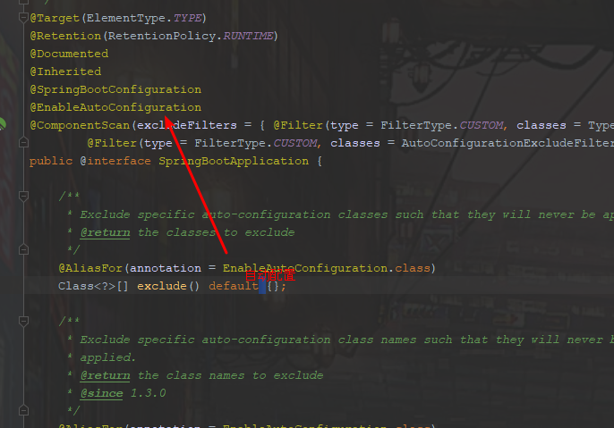
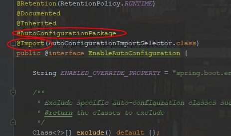
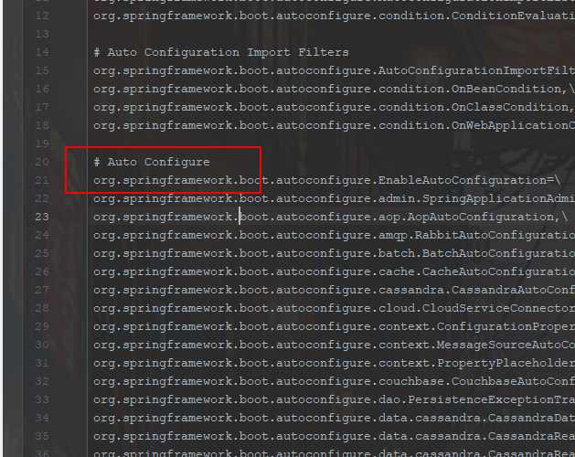
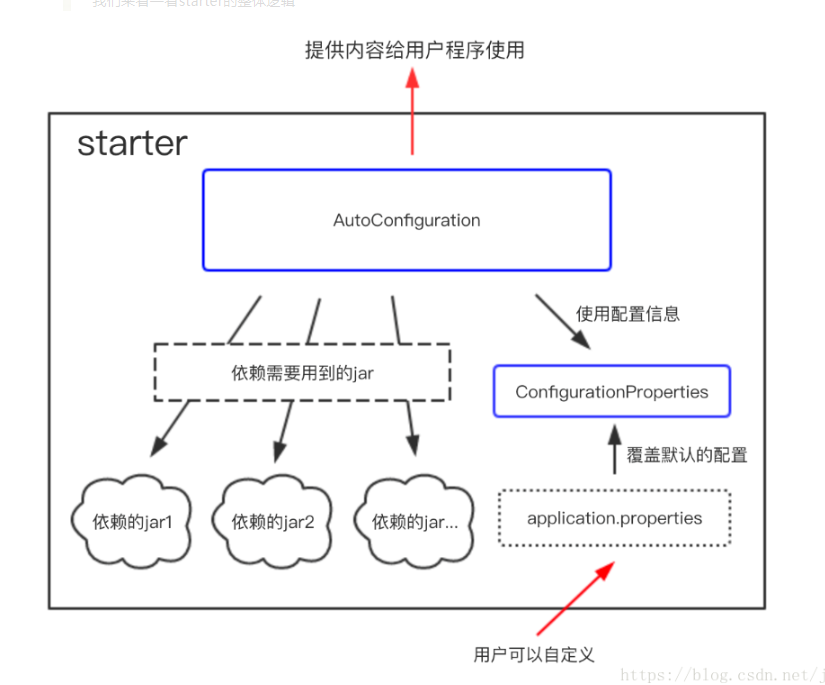
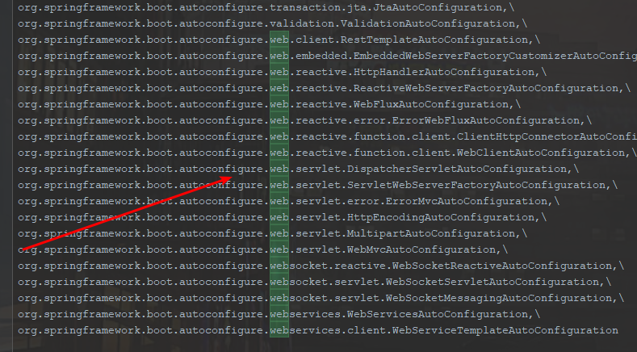
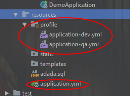

# 基于SpringCloud Alibaba的Project

作者:lomofu


## Navigate

- [QuickStart](#QuickStart)
- [版本](#版本：)

- [知识点](#知识点:)


## QuickStart

#### 	1.前往nacos官网下载nacos （本人1.0.3）

- [下载链接](https://github.com/alibaba/nacos/releases)

-  [Nacos文档](https://nacos.io/zh-cn/docs/quick-start.html)

  

#### 2.导入工程（maven）

​	执行  `mvn clean install`


#### 	3.其他 


## 版本：

#### 2019.10.16

> 版本：**1.0.3**
>
> 作者：**lomo fu**
>
> 内容：整合了README.md  SpringBoot知识点 通用Mapper Lombok
>


#### 2019.10.16

> 版本：**1.0.2**
>
> 作者：**lomo fu**
>
> 内容：整合Fegin 取代Rest Template
>
> ​			整合Sentinel和Sentinel Dashboard


#### **2019.10.15**

> 版本：**1.0.1**
>
> 作者：**lomo fu**
>
> 内容：整合了README.md SpringBoot知识点


#### **2019.10.15**

> 版本：**1.0**
>
> 作者：**lomo fu**
>
> 内容：整合了user-center 和content-center SpringBoot应用 
>
> ​			整合了RestTemplate
>
> ​			整合了Nacos服务发现
>
> ​			整合ribboo实现随机负载均衡，根据nacos权重负载均衡，根据集群负载均衡


## 知识点:

​	[一.关于SpringBoot本身](#一.关于SpringBoot本身)

​		[1.SpringBoot  开发基于三步:](#1.SpringBoot 开发基于三步:)

​					[1.依赖](#1.依赖)

​					[2.注解](#2.注解)

​					[3.配置](#3.配置)

​		[2.SpringBoot监控:](#2.SpringBoot 监控:)

[二.通用Mapper](#二.通用Mapper)

[三.Lombok](#三.Lombok)

[四.微服务拆分全景架构](#四.微服务拆分全景架构)

[Feign常见问题](http://www.imooc.com/article/289005)


------


### 一.关于SpringBoot本身


##### 	1.SpringBoot 开发基于三步:


###### 1.依赖

​	**Spring Boot中的Starter介绍:**

​		*启动器是一套方便的依赖没描述符*

​		*SpringBoot已经默认将这些场景配置好了，只需要在配置文件中指定少量的配置就可以了运行起来*

​		**Starter原理介绍:**

​		*首先是启动类*

1***.==@SpringBootApplication==*** 组成: 通过@SpringBootApplication注解标注此类为springboot启动类


> ​	 ==@*SpringBootConfiguration*==**: **
>
> **Spring Boot的配置类,表示是一个配置类(**@Configuration**)
>
> ​	==@*EnableAutoConfiguration*==：
>
> 开启自动配置功能





==@***EnableAutoConfiguration*** 组成：开启自动配置功能==

> ​	==*@AutoConfigurationPackage* :==
>
> 自动配置包,将主配置类（@SpringBootApplication标注的类）的所在包及下面所有子包里面的所有组件扫描到Spring容器。(相当于原来开启包扫描);
>
> ​	==*@Import*( *EnableAutoConfigurationImportSelector.class* ) :==
>
> Spring Boot在启动的时候从   `spring-boot-autoconfigure-2.1.9.RELEASE.jar`  包路径下的`META-INF/spring.factories`  中获取EnableAutoConfiguration指定的值，将这些值作为自动配置类导入到容器中，自动配置类就生效，帮我们进行自动配置工作；以前我们需要自己配置的东西，自动配置类都帮我们(例如SpringMVC中的视图解析器之类的);







> 将configuration类中定义的bean加入spring到容器中**。**就相当于加载之前我们自己配置组件的xml文件。而现在SpringBoot自己定义了一个默认的值，然后直接加载进入了Spring容器。


```java
@Override
//传入参数注解的元数据
public String[] selectImports(AnnotationMetadata annotationMetadata) {   
    //如果注解元数据不可得
    if (!isEnabled(annotationMetadata)) {      
        return NO_IMPORTS;   
    }
    //根据当前bean的ClassLoader加载自动配置元数据
    AutoConfigurationMetadata autoConfigurationMetadata = AutoConfigurationMetadataLoader         .loadMetadata(this.beanClassLoader);
    //通过自动配置元数据得到配置实例
    AutoConfigurationEntry autoConfigurationEntry = 								          getAutoConfigurationEntry(autoConfigurationMetadata,annotationMetadata); 
     // 返回最终得到的自动化配置类
    return StringUtils.toStringArray(autoConfigurationEntry.getConfigurations());
}


protected AutoConfigurationEntry getAutoConfigurationEntry(AutoConfigurationMetadata autoConfigurationMetadata,
			AnnotationMetadata annotationMetadata) {
		if (!isEnabled(annotationMetadata)) {
			return EMPTY_ENTRY;
		}
    	 // 获取注解的属性
		AnnotationAttributes attributes = getAttributes(annotationMetadata);
     	// 读取spring.factories属性文件中的数据
		List<String> configurations = getCandidateConfigurations(annotationMetadata, attributes);
    	// 删除重复的配置类
		configurations = removeDuplicates(configurations);
        // 找到@EnableAutoConfiguration注解中定义的需要被过滤的配置类
		Set<String> exclusions = getExclusions(annotationMetadata, attributes);
		checkExcludedClasses(configurations, exclusions);
     	// 删除这些需要被过滤的配置类
		configurations.removeAll(exclusions);
		configurations = filter(configurations, autoConfigurationMetadata);
		fireAutoConfigurationImportEvents(configurations, exclusions);
		return new AutoConfigurationEntry(configurations, exclusions);
	}


protected List<String> getCandidateConfigurations(AnnotationMetadata metadata, AnnotationAttributes attributes) {
    // 调用SpringFactoriesLoader的loadFactoryNames静态方法
  	// getSpringFactoriesLoaderFactoryClass方法返回的是EnableAutoConfiguration类对象
		List<String> configurations = SpringFactoriesLoader.loadFactoryNames(getSpringFactoriesLoaderFactoryClass(),
				getBeanClassLoader());
		Assert.notEmpty(configurations, "No auto configuration classes found in META-INF/spring.factories. If you "
				+ "are using a custom packaging, make sure that file is correct.");
		return configurations;
	}


```

> Spring Framework内部使用一种**工厂加载机制(Factory Loading Mechanism)**。这种机制使用SpringFactoriesLoader完成，SpringFactoriesLoader使用loadFactories方法加载并实例化从META-INF目录里的spring.factories文件出来的工厂，这些spring.factories文件都是从classpath里的jar包里找出来的。


**1.1 starter 总体流程:**



*扩展 自定义启动类: https://segmentfault.com/a/1190000011433487#articleHeader5*


**1.2 demo**:

```xml
<!--这里以spring-boot-starter-web会引入spring-webmvc等模块的依赖，引入自己所需要的依赖-->
<dependency>    
	<groupId>org.springframework.boot</groupId>    
	<artifactId>spring-boot-starter-web</artifactId>
</dependency>	
```




###### 2.注解

​	[SpringBoot 注解大全](https://blog.csdn.net/weixin_40753536/article/details/81285046)


> #### 常见问题

​	*1.@Resource 和 @AutoWire区别?*

|              |                          @Resource                           |                          @Autowire                           |
| ------------ | :----------------------------------------------------------: | :----------------------------------------------------------: |
| 注解来源     |                             JDK                              |                            Spring                            |
| 装配方式     |                          优先按名称                          |                          优先按类型                          |
| 属性         |                                                              |                                                              |
| 组合(ByName) |                   @Resource(name ="name")                    |             @Autowired()<br />@Qualifier("name")             |
| 总结         | 推荐使用：@Resource注解在字段上，这样就不用写setter方法了，并且这个注解是属于J2EE的，减少了与spring的耦合。这样代码看起就比较优雅。 | 推荐使用：@Resource注解在字段上，这样就不用写setter方法了，并且这个注解是属于J2EE的，减少了与spring的耦合。这样代码看起就比较优雅。 |


​	 *2.Spring @Component，@ Service，@ Repository，@ Controller差异?*

|    注解名    |                     作用                     |
| :----------: | :------------------------------------------: |
|  @Component  | 最普通的组件，可以被注入到spring容器进行管理 |
| @ Repository |                 作用于持久层                 |
|  @ Service   |               作用于业务逻辑层               |
| @ Controller |       作用于表现层（spring-mvc的注解）       |


*3.Spring Boot 核心几个注解*

|     注解名     |                             作用                             |
| :------------: | :----------------------------------------------------------: |
| @Configuration | 用来代替 applicationContext.xml 配置文件，所有这个配置文件里面能做到的事情都可以通过这个注解所在类来进行注册 |
|     @Bean      |        用来代替 XML 配置文件里面的 <bean ...> 配置。         |
|    @Import     | 用来引入额外的一个或者多个 @Configuration 修饰的配置文件类。 |
| @ComponentScan | 用来代替配置文件中的 component-scan 配置，开启组件扫描，即自动扫描包路径下的 @Component 注解进行注册 bean 实例到 context 中。 |


###### 3.配置

 3.1 读取配置文件


**@Value( “ ${ 属性名 } ” )**

**1.application.yml**

```yaml
spring:
  profiles:
    active: qa
server:
  port: 8080
---
spring:
  profiles: dev

server:
  port: 8081
my:
  id: ${random.int}
  name : lomo-dev
---
spring:
  profiles: qa

server:
  port: 8088
my:
  id: ${random.int}
  name: lomo-qa
```

2.java:

```java
@Data
@Component
@Scope(scopeName = "prototype")
public class My {

    @Value("${my.id}")
    private Integer id;
    @Value("${my.name}")
    private String name;


}

@RestController
public class Controller {

    @Resource
    private My my;

    @GetMapping("test")
    public HashMap<String, Object> get(){
        HashMap<String, Object> hashMap = new HashMap<>();
        hashMap.put("id", my.getId());
        hashMap.put("name", my.getName());
        return hashMap;
    }

}
```


------


@**ConfigurationProperties** (prefix = "keyName")

1.application.yml

```
spring:
  profiles:
    active: qa
server:
  port: 8080
---
spring:
  profiles: dev

server:
  port: 8081
my:
  name: forezp
  age: 12
  number:  ${random.int}
  uuid : ${random.uuid}
  max: ${random.int(10)}
  value: ${random.value}
  greeting: hi,i'm  ${my.name}
---
spring:
  profiles: qa

server:
  port: 8088
my:
  name: forezp
  age: 12
  number:  ${random.int}
  uuid : ${random.uuid}
  max: ${random.int(10)}
  value: ${random.value}
  greeting: hi,i'm  ${my.name}


```

${random} ，它可以用来生成各种不同类型的随机值。


2.java:

```java
@Data
@Component
@ConfigurationProperties(prefix = "my")
public class My {
    private String name;
    private int age;
    private int number;
    private String uuid;
    private int max;
    private String value;
    private String greeting;
}

```

3.另外需要在应用类或者application类，加`@EnableConfigurationProperties`注解。

```java
@SpringBootApplication
@EnableConfigurationProperties
public class DemoApplication {    
	public static void main(String[] args) {
    			SpringApplication.run(DemoApplication.class, args);    
			}
	}
```


------


**@PropertySource(value = "classpath:自定义配置.properties")**

1.test.properties

```yml
my.name=forezp
my.age=12
```

2.java:

```java
@Data
@Configuration
@PropertySource(value = "classpath:test.properties")
@ConfigurationProperties(prefix = "my")
public class My {
    private String name;
    private int age;
    private int number;
    private String uuid;
    private int max;
    private String value;
    private String greeting;
}


@RestController
public class Controller {

    @Resource
    private My my;

    @GetMapping("test")
    public HashMap<String, Object> get(){
        HashMap<String, Object> hashMap = new HashMap<>();
        hashMap.put("age", my.getAge());
        hashMap.put("name", my.getName());
        return hashMap;
    }

}
```

3.需要在应用类或者application类,`@EnableConfigurationProperties({ User.class })`

```java
@SpringBootApplication
@EnableConfigurationProperties({My.class})
public class DemoApplication {    
				public static void main(String[] args) { 							                             SpringApplication.run(DemoApplication.class, args);
					}
				}
```


3.2  多环境配置


*. properties

>  在现实的开发环境中，我们需要不同的配置环境；格式为application-{profile}.properties，其中{profile}对应你的环境标识，比如：
>
> - application-test.properties：测试环境
> - application-dev.properties：开发环境
> - application-prod.properties：生产环境


*. yml

```yml
#指定运行时环境
spring:
  profiles:
    active: qa
server:
  port: 8080
---
#DEV
spring:
  profiles: dev

server:
  port: 8081
my:
  name: forezp
  age: 12
  number:  ${random.int}
  uuid : ${random.uuid}
  max: ${random.int(10)}
  value: ${random.value}
  greeting: hi,i'm  ${my.name}
---
#QA
spring:
  profiles: qa

server:
  port: 8088


```

 参考:	[读取配置文件](https://www.cnblogs.com/jtlgb/p/8532280.html)


3.2.1 结合maven实现多环境

   	1.配置多个文件

​			目录结构如下:




application.yml

```yaml
server:
  port: 8085

my:
  name: @profileActive@

const:
  value: lomofu
```


application-dev.yml

```yaml
server:
  port: 8085

my:
  name: dev
```


application-qa.yml

```
server:
  port: 8088

my:
  name: qa
```


pom.xml

```xml
<?xml version="1.0" encoding="UTF-8"?>
<project xmlns="http://maven.apache.org/POM/4.0.0" xmlns:xsi="http://www.w3.org/2001/XMLSchema-instance"
  xsi:schemaLocation="http://maven.apache.org/POM/4.0.0 https://maven.apache.org/xsd/maven-4.0.0.xsd">
    <modelVersion>4.0.0</modelVersion>
    <parent>
        <groupId>org.springframework.boot</groupId>
        <artifactId>spring-boot-starter-parent</artifactId>
        <version>2.1.9.RELEASE</version>
        <relativePath/> <!-- lookup parent from repository -->
    </parent>
    <groupId>com.example</groupId>
    <artifactId>demo</artifactId>
    <version>0.0.1-SNAPSHOT</version>
    <name>demo</name>
    <description>Demo project for Spring Boot</description>

    <properties>
        <java.version>1.8</java.version>
    </properties>

    <profiles>
        <profile>
            <id>dev</id>
            <properties>
                <!-- 环境标识，需要与配置文件的名称相对应 -->
                <profileActive>dev</profileActive>
            </properties>
            <activation>
                <!-- 默认环境 -->
                <activeByDefault>true</activeByDefault>
            </activation>
        </profile>
        <profile>
            <id>qa</id>
            <properties>
                <!--@占位符所替换的值-->
                <profileActive>qa</profileActive>
            </properties>
        </profile>
    </profiles>

    <dependencies>
        <dependency>
            <groupId>org.springframework.boot</groupId>
            <artifactId>spring-boot-starter-web</artifactId>
        </dependency>

        <dependency>
            <groupId>org.springframework.boot</groupId>
            <artifactId>spring-boot-starter-test</artifactId>
            <scope>test</scope>
        </dependency>
        <dependency>
            <groupId>org.projectlombok</groupId>
            <artifactId>lombok</artifactId>
            <optional>true</optional>
        </dependency>
        <dependency>
            <groupId>org.springframework.boot</groupId>
            <artifactId>spring-boot-configuration-processor</artifactId>
            <optional>true</optional>
        </dependency>
    </dependencies>

    <build>
        <resources>
            <resource>
                <directory>src/main/resources/profile</directory>
                <excludes>
                    <exclude>application*.properties</exclude>
                </excludes>
            </resource>
            <resource>
                <directory>src/main/resources</directory>
                <!-- 是否替换@xx@表示的maven properties属性值 重要一定开启 -->
                <filtering>true</filtering>
                <includes>
                    <include>application.yml</include>
                    <include>application-${profileActive}.yml</include>
                </includes>
            </resource>
        </resources>
        <plugins>
            <plugin>
                <groupId>org.springframework.boot</groupId>
                <artifactId>spring-boot-maven-plugin</artifactId>
                <configuration>
                   <!--springboot启动类目录-->
                    <mainClass>com.example.demo.DemoApplication</mainClass>
                </configuration>
                <executions>
                    <execution>
                        <goals>
                            <!--创建一个自动可执行的jar或war文件 -->
                            <goal>repackage</goal>
                        </goals>
                    </execution>
                </executions>
            </plugin>
        </plugins>
    </build>
</project>

```


Java:

```java
@Data
@Component
public class My {
    @Value("${my.name}")
    private String name;
}

```

```java
@Component
@Data
public class Constant {

    @Value("${const.value}")
    private String value;

}

```

```java
@RestController
public class Controller {

    @Resource
    private My my;
    @Resource
    private Constant constant;

    @GetMapping("test")
    public HashMap<String, Object> get(){
        HashMap<String, Object> hashMap = new HashMap<>();
        hashMap.put("name", my.getName());
        hashMap.put("const", constant.getValue());
        return hashMap;
    }

}
```

参考:   [多环境配置1]( https://www.jb51.net/article/127261.htm )   [配置多环境2](https://www.jianshu.com/p/f24b312db08b)


##### 2.SpringBoot 监控:

​		**Actuator 监控:**   Actuator插件是SpringBoot原生提供的一个服务，可以通过暴露端点路由，用来输出应用中的诸多端点信息。 


pom.xml

```xml
<dependency>
    <groupId>org.springframework.boot</groupId>
    <artifactId>spring-boot-starter-actuator</artifactId>
</dependency>
```

 application.yml 

```yaml
###通过下面的配置启用所有的监控端点，默认情况下，这些端点是禁用的；加入这个配置。监控所有接口
management:
  endpoints:
    web:
      exposure:
        include: "*"
```


应用启动后:

```http
/actuator        端点信息
/info 　　　　　　　应用基本信息
/health 　　　　　　健康度信息
/metrics 　　　　　运行指标
/env 　　　　　　　环境变量信息
/loggers 　　　　　日志相关
/dump 　　　　　　线程相关信息
/trace 　　　　　　请求调用轨迹
```

[参考 ](https://www.jianshu.com/p/e9ce05b44150)	


### 二.通用Mapper	

###### 	**1.SpringBoot集成Mapper依赖**

```xml
<dependency>
  <groupId>tk.mybatis</groupId>
  <artifactId>mapper-spring-boot-starter</artifactId>
  <version>版本号</version>
</dependency>
```


###### 	 2.使用 `@MapperScan` 注解

java:

```java
@tk.mybatis.spring.annotation.MapperScan(basePackages = "扫描包")
@SpringBootApplication
public class SampleMapperApplication implements CommandLineRunner {

}
```

或者

application.yml

```yaml
mapper:
  mappers:
    - tk.mybatis.mapper.common.Mapper
    - tk.mybatis.mapper.common.Mapper2
  notEmpty: true
```


###### 	3.使用`mappergenerator`代码生成器

​	   使用该插件可以很方便的生成实体类、Mapper接口以及对应的XML文件.


pom.xml

```xml
  <plugin>
    <artifactId>maven-compiler-plugin</artifactId>
    <configuration>
      <source>${jdk.version}</source>
      <target>${jdk.version}</target>
    </configuration>
  </plugin>
  <plugin>
    <groupId>org.mybatis.generator</groupId>
    <artifactId>mybatis-generator-maven-plugin</artifactId>
    <version>1.3.6</version>
    <configuration>
      <configurationFile>
        ${basedir}/src/main/resources/generator/generatorConfig.xml
      </configurationFile>
      <overwrite>true</overwrite>
      <verbose>true</verbose>
    </configuration>
    <dependencies>
      <dependency>
        <groupId>mysql</groupId>
        <artifactId>mysql-connector-java</artifactId>
        <version>5.1.29</version>
      </dependency>
      <dependency>
        <groupId>tk.mybatis</groupId>
        <artifactId>mapper</artifactId>
        <version>4.0.0</version>
      </dependency>
    </dependencies>
  </plugin>
</plugins>
```


 [generatorConfig.xml](https://github.com/abel533/MyBatis-Spring-Boot/blob/master/src/main/resources/generator/generatorConfig.xml) 

```xml
<?xml version="1.0" encoding="UTF-8"?>
<!DOCTYPE generatorConfiguration
        PUBLIC "-//mybatis.org//DTD MyBatis Generator Configuration 1.0//EN"
        "http://mybatis.org/dtd/mybatis-generator-config_1_0.dtd">

<generatorConfiguration>
    <!--外部properties文件-->
    <properties resource="application-dev.properties"/>

    <context id="Mysql" targetRuntime="MyBatis3Simple" defaultModelType="flat">
        <property name="beginningDelimiter" value="`"/>
        <property name="endingDelimiter" value="`"/>

        <plugin type="tk.mybatis.mapper.generator.MapperPlugin">
            <property name="mappers" value="tk.mybatis.springboot.util.MyMapper"/>
        </plugin>

        <jdbcConnection driverClass="${spring.datasource.driver-class-name}"
                        connectionURL="${spring.datasource.url}"
                        userId="${spring.datasource.username}"
                        password="${spring.datasource.password}">
        </jdbcConnection>

        <!--实体类生成目录-->
        <javaModelGenerator targetPackage="tk.mybatis.springboot.model" targetProject="src/main/java"/>

        <!--sql生成目录-->
        <sqlMapGenerator targetPackage="mapper" targetProject="src/main/resources"/>

        <!--dao层  mapper生成目录-->
        <javaClientGenerator targetPackage="tk.mybatis.springboot.mapper" targetProject="src/main/java"
                             type="XMLMAPPER"/>

        <table tableName="country">
            <!--mysql 配置-->
            <generatedKey column="id" sqlStatement="Mysql" identity="true"/>
            <!--oracle 配置-->
            <!--<generatedKey column="id" sqlStatement="select SEQ_{1}.nextval from dual" identity="false" type="pre"/>-->
        </table>
    </context>
</generatorConfiguration>
```


外部properties

```properties
spring.datasource.driver-class-name=xxxxx
spring.datasource.url=xxxxx
spring.datasource.username=xxxxx
spring.datasource.password=xxxxx
```


>  lombok 增加 model 代码生成时，可以直接生成 lombok 的 `@Getter@Setter@ToString@Accessors(chain = true)` 四类注解， 使用者在插件配置项中增加 `` 即可生成对应包含注解的 model 类。 
>
> 经过测试目前支持以上这四个注解不支持@Data @NotArg..注解
>
> 测试时间:2019.10.14
>
> 测试版本:2.1.5


###### 4.api快速预览

```java
public interface CountryMapper extends Mapper<Country> {
}
```

- *selectOne*
- *select*
- *selectAll*
- *selectCount*
- *selectByPrimaryKey*
- *方法太多，省略其他...*


 **如果想要增加自己写的方法，可以直接在 `CountryMapper` 中增加。** 

 **1. 使用纯接口注解方式时** 

```java
public interface CountryMapper extends Mapper<Country> {
    @Select("select * from country where countryname = #{countryname}")
    Country selectByCountryName(String countryname);
}
```

 **2. 如果使用 XML 方式，需要提供接口对应的 XML 文件** (MyBatis)

 例如提供了 `CountryMapper.xml` 文件，内容如下： 

```xml
<!DOCTYPE mapper
        PUBLIC "-//mybatis.org//DTD Mapper 3.0//EN"
        "http://mybatis.org/dtd/mybatis-3-mapper.dtd">
<mapper namespace="tk.mybatis.sample.mapper.CountryMapper">
    <select id="selectByCountryName" resultType="tk.mybatis.model.Country">
        select * from country where countryname = #{countryname}
    </select>
</mapper>
```

java

```java
public interface CountryMapper extends Mapper<Country> {
    Country selectByCountryName(String countryname);
}
```


​	[官方文档](https://github.com/abel533/Mapper/wiki/2.2-mapping)


### 三.Lombok

常用注解

| 名称     | 作用                                                         |
| -------- | ------------------------------------------------------------ |
| @Getter  |                                                              |
| @Setter  |                                                              |
| @NonNull | 给方法参数增加这个注解会自动在方法内对该参数进行是否为空的校验，如果为空，则抛出（NullPointerException） |
| @Data    | 同时使用了@ToString、@EqualsAndHashCode、@Getter、@Setter和@RequiredArgsConstrutor这些注解 |
| @Value   | 用在类上，是@Data的不可变形式，相当于为属性添加final声明，只提供getter方法，而不提供setter方法 |
| @Builder | 使用建造者模式                                               |
| @Cleanup |                                                              |

```java
  try {
            @CleanupInputStream inputStream = newFileInputStream(args[0]);
        } catch (FileNotFoundException e) {
            e.printStackTrace();
        }
        
        //=>相当于
        
        
        InputStream inputStream = null;
        try {
            inputStream = newFileInputStream(args[0]);
        } catch (FileNotFoundException e) {
            e.printStackTrace();
        } finally {
            if (inputStream != null) {
                try {
                    inputStream.close();
                } catch (IOException e) {
                    e.printStackTrace();
                }
            }
        }
    }
```

>  技巧:  Field injection is not recommended 依赖注入方式

  Field注入应该尽可能地去避免使用。作为替代，你应该使用构构造器注入或Setter注入。他们都有利有弊，需要视情况而定。当然你可以在同一个类中使用这两种方法。构造器注入更适合强制性的注入旨在不变性，Setter注入更适合可变性的注入。 

 解决:

​	***@RequiredArgsConstructor(onConstructor = @__(@Autowired))*** 

​	或者

​	***@Resource***

​	来解耦


### 四.微服务拆分全景架构


​																	图 全景架构